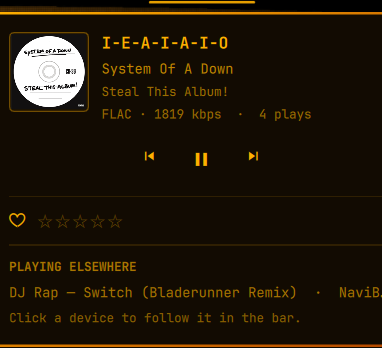
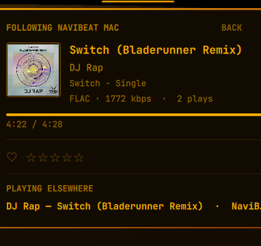
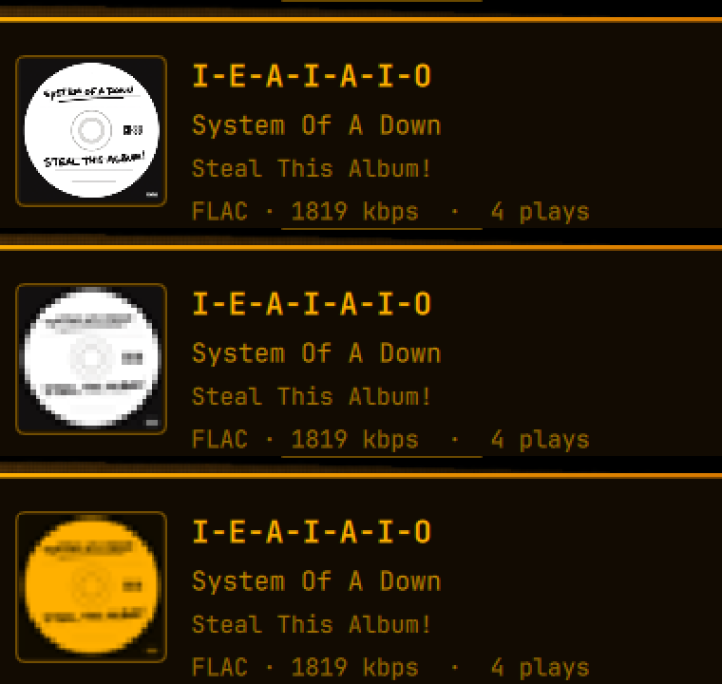

<div align="center">

# NaviBeat for the Omarchy bar

**Now playing in the bar, plus the parts only your own Navidrome server knows:
star and rate the track server-side, see its real format and bitrate, and follow
what is playing on another device.**

Built for the [Omarchy](https://omarchy.org) shell. It does not reimplement
MPRIS — it consumes Omarchy's own media service for playback and adds the server
layer on top.

[Install](#install) &nbsp;&middot;&nbsp; [Setup](#setup) &nbsp;&middot;&nbsp; [Using it](#using-it) &nbsp;&middot;&nbsp; [How it works](#how-it-works) &nbsp;&middot;&nbsp; [Report a bug](../../issues/new)

[](../../stargazers)
[](LICENSE)
[](../../commits/main)
[](../../issues)

[](https://buymeacoffee.com/nenadjokic)
[](https://paypal.me/nenadjokicRS)



</div>

> Works with any [Navidrome](https://www.navidrome.org) or OpenSubsonic server.
> [NaviBeat](https://navibeat.app) is not required — it is just the client whose
> credentials the widget will reuse if you have it, so that there is nothing to
> configure.

## Requirements

- Omarchy with the Quickshell-based shell (`omarchy plugin` available)
- A Navidrome or OpenSubsonic server
- `python3` — standard library only, nothing to install
- Optional: [NaviBeat](https://navibeat.app), whose credentials are picked up
  automatically

## Install

```sh
omarchy plugin add https://github.com/nenadjokic/omarchy-navibeat.git --enable
omarchy bar move nenadjokic.navibeat --after omarchy.clock
omarchy restart shell
```

The restart matters: a new bar widget is not picked up by hot-reload.

## Setup

If NaviBeat is installed and signed in, there is nothing to do — the widget
reads `~/.config/navibeat/credentials.json`, preferring the LAN address over the
public one.

Otherwise write `~/.config/omarchy-navibeat/config.json`:

```json
{
  "baseUrl": "https://music.example.com",
  "username": "you",
  "password": "your-password"
}
```

Your password is never sent over the wire: Subsonic salted-token authentication
hashes it with a fresh salt on every request.

## Using it

The bar shows a waveform and the current track. It is there **from the moment the
music app is running**, not only once something is playing — an idle app still
gets its place in the bar. It disappears only when the app is closed and no
device is being followed.

| Action | Result |
| --- | --- |
| Left click | open the panel |
| Right click | play / pause |
| Middle click | next track |
| Scroll | previous / next |
| Click the artwork | cycle artwork style |
| Click a device under *playing elsewhere* | follow it in the bar |

### Following another device



Click a session under **playing elsewhere** and the bar follows that device
instead: its track scrolls in the top bar, with the artwork and a live progress
bar. `BACK` returns to this machine.

**What you are watching only ever changes when you click.** If the followed
device pauses, sleeps or drops off the network it stops reporting within a
minute — the panel then says `IDLE` and keeps showing what it last saw. It does
not quietly snap back to local playback, because a view that moves out from
under you is worse than a stale one.

It is deliberately **read-only**. The Subsonic protocol has no command that
controls another client — even NaviBeat's own handoff works by the *taken-over*
device noticing and pausing itself, not by one device driving another. So the
transport row is hidden rather than shown dead.

**Starring and rating still work while following**, because those are server-side
writes and have nothing to do with who is playing. Love a track from your desk
while it plays on the TV.

### Artwork styles



Clicking the cover cycles **full resolution → pixel → pixel in the theme
colour**. The pixel look is not a blur filter: NaviBeat's terminal UI samples
covers to 28×28 and paints them in half-block cells, so this asks the server for
a 28px cover and draws it with smoothing off, which reproduces that exactly. The
third style tints those pixels to the bar's own foreground, so the artwork stops
being the one thing in the bar that ignores your theme — change the Omarchy theme
and it follows.

The choice is remembered across restarts.

### In the bar


The waveform animates only while audio is actually playing, so it reads as a
status light rather than as decoration. Bars grow from the centre rather than
from a baseline: an equalizer anchored to its floor puts all its weight at the
bottom of the icon and reads as misaligned next to centred text.

A track name wider than `maxLabelWidth` scrolls, and stops scrolling while the
panel is open so the two are never moving at once.

## Settings

| Key | Default | Meaning |
| --- | --- | --- |
| `showLabel` | `true` | show the track name next to the icon |
| `maxLabelWidth` | `180` | how much bar width the name may take |
| `localDevice` | `NaviBeat Linux` | this machine's client name, filtered out of *playing elsewhere* |
| `appPlayer` | `navibeat` | MPRIS player whose mere presence keeps the widget in the bar |

```sh
omarchy bar set nenadjokic.navibeat maxLabelWidth 120
```

`localDevice` matters if you run something other than NaviBeat Linux here:
sessions carrying that client name are treated as this machine, so they are not
listed as another device.

## Command line

```sh
P=~/.config/omarchy/plugins/nenadjokic.navibeat/bin/omarchy-navibeat

$P status                 # server reachable + what is playing elsewhere
$P nowplaying             # every session, raw
$P song <id>              # one track: starred, rating, format, play count
$P star <id> / unstar <id>
$P rate <id> <0-5>
$P cover <id> [px]        # download a cover, print the path
$P find 'artist|album|title'
```

IPC, for keybinds:

```sh
qs -p /usr/share/omarchy/shell ipc call nenadjokic.navibeat toggle
qs -p /usr/share/omarchy/shell ipc call nenadjokic.navibeat star
qs -p /usr/share/omarchy/shell ipc call nenadjokic.navibeat art
qs -p /usr/share/omarchy/shell ipc call nenadjokic.navibeat follow "NaviBeat Mac"
qs -p /usr/share/omarchy/shell ipc call nenadjokic.navibeat probe   # why it is/isn't shown
```

## How it works

**Playback is not reimplemented.** Omarchy ships a first-party media service
(`omarchy.media`) that already owns MPRIS, picks the active player and exposes
the transport actions. This widget consumes it through
`bar.shell.firstPartyServiceFor("omarchy.media")`, exactly as the built-in media
widget and the audio panel do. Everything it adds is what MPRIS has no concept
of, and all of that comes from the server over the Subsonic API.

**Tracks are identified exactly where possible.** NaviBeat puts the Navidrome
song id straight into `mpris:trackid` as `/app/navibeat/track/<id>`, so when it
is there the id is read directly. Only for other players does it fall back to
searching by title and scoring candidates on artist and album — and a candidate
that agrees on neither is rejected, because starring a cover version by mistake
is worse than starring nothing.

**Writes are never assumed.** After a star or a rating the track is re-read from
the server rather than flipped locally, so the panel cannot show a state the
server does not hold.

**Other devices come from `getNowPlaying`**, which reports each session's client
name, state, position and duration. Position arrives only once per poll, so it is
advanced locally between polls and re-anchored on each one; without that the
progress bar would look frozen for eight seconds at a time.

## What it trusts

The server is your own, but the widget does not take that as licence to believe
whatever comes back from it. A Navidrome instance can be shared, reachable from
outside, or simply serving tags somebody else wrote, and everything below holds
either way.

**Nothing is read without a limit.** Every API response, every configuration
file and every piece of cover art is read through a hard byte cap that is
checked *before* the bytes are parsed or returned — 4 MiB for a JSON response,
8 MiB for cover art, 256 KiB for a config file. Cover art is streamed straight
to disk in 64 KiB chunks rather than being assembled in memory, so a server that
keeps sending cannot grow the helper or fill the disk; it is cut off at the cap.

**Paths cannot be redirected.** The config and cache directories are opened one
component at a time with `O_NOFOLLOW`, and each descriptor is checked to be a
directory owned by you and not writable by anyone else — the two directories
this plugin owns are tightened to `0700` in place if they are not, since a mode
passed to `makedirs` does nothing to a directory that already exists. Files are
then opened relative to those descriptors instead of by walking a path a second
time. Writes land in a randomly named temporary file created `O_EXCL |
O_NOFOLLOW` at `0600` and are published with a descriptor-relative rename, so a
symlink planted in advance is refused rather than followed. Cover art is stored
under the SHA-256 of its id, never under the id itself, so a server-supplied
identifier cannot steer a download out of the cache directory.

**Credentials stay with the server they belong to.** The password is never sent
— Subsonic salted-token authentication hashes it with a fresh salt per request —
the configured URL must be `http://` or `https://`, and a redirect that leaves
that host is refused rather than followed, because the auth token travels in the
query string. An http→https upgrade on the same host still works.

**Server text is drawn as text.** Track titles, artist names and the client
names other devices report are rendered by `Text` elements pinned to
`Text.PlainText`, and the one string that leaves for a shell-owned element — the
bar tooltip — has markup and control characters removed first. Nothing the
server returns can be promoted to rich text inside the shell process, which is
what would otherwise let a crafted tag make it fetch a remote resource.

## Files it writes

| Path | Contents |
| --- | --- |
| `~/.config/omarchy-navibeat/prefs.json` | artwork style |
| `~/.config/omarchy-navibeat/config.json` | credentials, only if you are not using NaviBeat |
| `~/.cache/omarchy-navibeat/` | downloaded covers, named by content hash |

Both directories are created `0700` and every file in them `0600`. Nothing is
sent anywhere except your own server.

## Troubleshooting

**Nothing in the bar.** By design: it hides when nothing is playing here and no
device is being followed.

**A device is missing from *playing elsewhere*.** Clients only appear once they
send a now-playing ping, which they do on track start and resume — so a device
paused before you looked may not be listed. Check with `omarchy-navibeat
nowplaying`, which shows exactly what the server reports.

**Stars and ratings are greyed out.** The track could not be matched to a server
song. `omarchy-navibeat find 'artist|album|title'` shows what the matcher sees.

**A new widget does not appear.** Hot-reload does not create bar widget
instances. `omarchy restart shell`.

**Odd behaviour after editing the plugin.** A hot-reload can leave a stale
instance holding the IPC target, so IPC calls reach a widget you cannot see.
`omarchy restart shell` clears it. Real QML errors only appear in
`journalctl --user -t omarchy-shell`.

## Uninstall

```sh
omarchy plugin remove nenadjokic.navibeat
rm -rf ~/.config/omarchy-navibeat ~/.cache/omarchy-navibeat
omarchy restart shell
```

## Support the developer

This widget is free, with no ads and no tracking. If it earns a place in your
bar, a coffee genuinely helps and means a lot.

<div align="center">

[](https://buymeacoffee.com/nenadjokic)
&nbsp;
[](https://paypal.me/nenadjokicRS)

</div>

---

## License

MIT — see [LICENSE](LICENSE).
